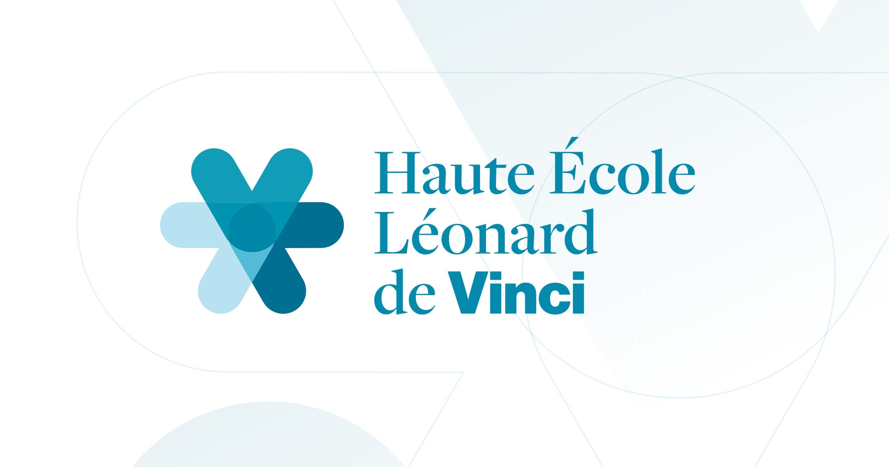

<a name="readme-top"></a>

[![Issues][issues-shield]][issues-url]

<!-- PROJECT LOGO -->

<br />
<div align="center">
  <a href="https://github.com/samuser107/htmlProject/">
    
  </a>

  <h3 align="center">HTML project 1</h3>

  <p align="center">
    12th group
    <br />
    <a href="https://github.com/samuser107/htmlProject/issues">Report Bug</a>
    ·
    <a href="https://github.com/samuser107/htmlProject/issues">Request Feature</a>
  </p>
</div>

<!-- TABLE OF CONTENTS -->
<details>
  <summary>Table of Contents</summary>
  <ol>
    <li>
      <a href="#about-the-project">About The Project</a>
      <ul>
        <li><a href="#specifications">Specifications</a></li>
        <li><a href="#methodology">Methodology</a></li>
        <li><a href="#examination-criteria">Examination criteria</a></li>
      </ul>
    </li>
    <li>
      <a href="#getting-started">Getting Started</a>
      <ul>
        <li><a href="#prerequisites">Prerequisites</a></li>
        <li><a href="#installation">Installation</a></li>
      </ul>
    </li>
    <li><a href="#usage">Usage</a></li>
    <li><a href="#roadmap">Roadmap</a></li>
  </ol>
</details>


<!-- ABOUT THE PROJECT -->
## About The Project

### Specifications

- [ ] The website will have a common header and menu for all the pages of the website. This will need to be defined/worked on together by the team.
- [ ] The menu will give access to every member page of the team. The menu will have to have a dynamic appearance (hover). http://ochoquet.be/syllabusHTML/css_formatage.html#liens
- [ ] The name of all members of the team will be written at the end of every page. This will
need to be defined/worked on together by the team.
- [ ] The stylesheet must be common for all the pages of the website. This will need to be defined/worked on together by the team.
- [ ] Every member will have to create their own HTML page including these HTML elements:
  - [ ] one table
  - [ ] one image (personal image or free image) For example: https://pixabay.com/fr/
  - [ ] one form with at least two inputs
  - [ ] one list
  - [ ] one link
- [ ] Every member page must be named by the first name and last name of the member separated by an underscore. For example: olivier_choquet.html
- [ ] Every member will have to add an id or a class to their HTML page and determine a style for this id or class.

<p align="right"><a href="#readme-top">back to top</a></p>

### Methodology
It’s a work in teams, it’s important to discuss and make decisions with all members of the team for the common parts. The website should have a consistent appearance. One important part of this work is the code sharing and communication between members. Define together how to share your code in the team (OneDrive, …) and how to communicate among yourselves. Also think about how the integration of code will be done. Reminder of the methodology to create a website:
http://ochoquet.be/syllabusHTML/methodologie.html

<p align="right"><a href="#readme-top">back to top</a></p>

### Examination criteria

Here are the examination criteria for you grade.
1. Respect of specifications
2. Respect of copyrights for the images
   1. Use free images (https://pixabay.com/fr/ for example) or own images
3. Respect HTML5/CSS3 recommendations
   1. Good use of HTML5 tags
   2. External CSS sheet
4. Code and comments will be written in English
   1. The content can be written in any language
5. Code validation (http://validator.w3.org/). Very important !!!
6. Code readability (indentation, clearness)
7.  Spelling
8.  Delivery of work on time (MooVin upload)
9.  No JavaScript code
    1.  Bootstrap allowed (<i>Tailwind?</i>)
10. The footer contains the name and first name of all members of the team

<p align="right"><a href="#readme-top">back to top</a></p>

<!-- GETTING STARTED -->
## Getting Started

To get started, you can clone this repo.

### Prerequisites

Simple knowledge of HTML and CSS is required.

### Installation

_Below is an example of how you can instruct your audience on installing and setting up your app. This template doesn't rely on any external dependencies or services._

1. Install git requirements

1. Clone the repo
   ```sh
   git clone https://github.com/*Your_Username*/htmlProject.git
   ```

<p align="right">(<a href="#readme-top">back to top</a>)</p>

<!-- ROADMAP -->
## Roadmap

- [ ] Have a template of what we will create
- [ ] Create an even distribution of the tasks
- [ ] Add here...

See the [open issues](https://github.com/othneildrew/Best-README-Template/issues) for a full list of proposed features (and known issues).


[issues-shield]: https://img.shields.io/github/issues/othneildrew/Best-README-Template.svg?style=for-the-badge
[issues-url]: https://github.com/samuser107/htmlProject/issues