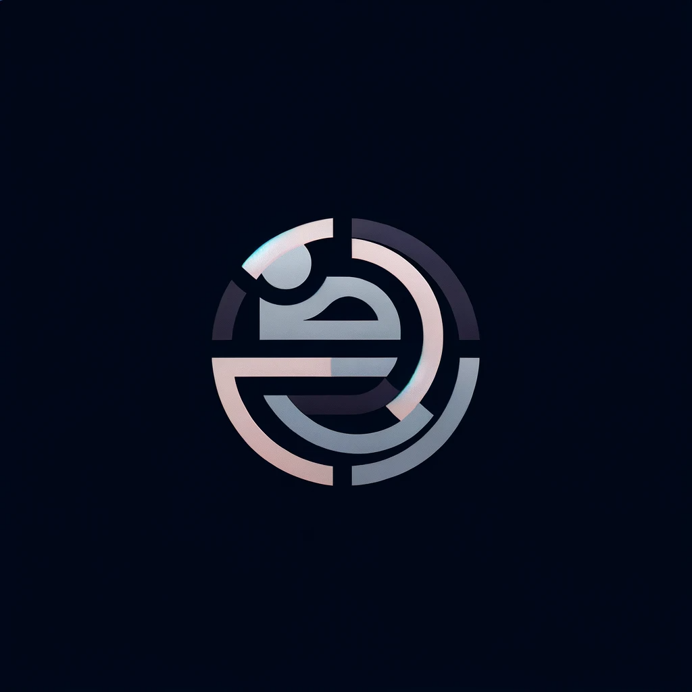

<a name="readme-top"></a>

<!-- [![Issues][issues-shield]][issues-url] -->

<!-- PROJECT LOGO -->

<br />
<div align="center">
  <a href="https://github.com/samuser107/htmlProject/">
    
  </a>

  <h3 align="center">HTML project</h3>

  <p align="center">
    12th group
    <br/>
    <b>Members :</b> Moulay Nimour, Louis-Nicolas Longheval, Alona Mykhailenko, Filipe Lopez, Rebecca Cotta and Reda Khalil
    <br/>
    <a href="https://github.com/samuser107/htmlProject/issues">Report Bug</a>
    ·
    <a href="https://github.com/samuser107/htmlProject/issues">Request Feature</a>
  </p>
</div>

<!-- TABLE OF CONTENTS -->
<details>
  <summary>Table of Contents</summary>
  <ol>
    <li>
      <a href="#about-the-project">About The Project</a>
      <ul>
      <li><a href="#global-informations">Global informations</a></li>
        <li><a href="#specifications">Specifications</a></li>
        <li><a href="#methodology">Methodology</a></li>
        <li><a href="#examination-criteria">Examination criteria</a></li>
      </ul>
    </li>
    <li>
      <a href="#getting-started">Getting Started</a>
      <ul>
        <li><a href="#prerequisites">Prerequisites</a></li>
        <li><a href="#installation">Installation</a></li>
      </ul>
    </li>
    <li><a href="#usage">Usage</a></li>
    <li><a href="#roadmap">Roadmap</a></li>
  </ol>
</details>


<!-- ABOUT THE PROJECT -->
## About The Project

### Global informations

#### Schedule of the project


<!-- - [ ] 2023-12-01: Project end (on Moovin) -->

#### Schedule of the help sessions
-  <i>1BIN2-1BIN3 Ve 17/11 14h30-16h30 Distanciel Mr Choquet</i>
-  <i>1BIN1-1BIN6 Je 23/11 13h45-15h45 Distanciel Mr LeCharlier</i>
-  <b>1BIN4-1BIN5-1BIN7 Ve 24/11 14h30-16h30 Distanciel Mr Choquet/Mr LeCharlier</b>

#### Contact
Email of Olivier Choquet : olivier.choquet@vinci.be

### Specifications

We ask you to write the HTML pages of a website presenting the restaurant of your team. Every
member will write one HTML page of this website and present on this page a part of the restaurant.
For example, you can present:
- [x] <b> Louis-Nicolas </b> : The food page of the restaurant.
- [ ] <b> Alona </b> : The drink page of the restaurant
- [x] <b> Reda </b> : The contact of the restaurant
- [x] <b> Moulay </b> : The food delivery page of the restaurant : 
- [ ] <b> Rebecca</b> : The event page of the restaurant
- [x] <b> Filipe </b> : A page who describes kitchen type
- ….
<br/>

- [ ] The website will have a common header and menu for all the pages of the website. This will need to be defined/worked on together by the team.
- [ ] The menu will give access to every member page of the team. The menu will have to have a dynamic appearance (hover). http://ochoquet.be/syllabusHTML/css_formatage.html#liens
- [ ] The name of all members of the team will be written at the end of every page. This will
need to be defined/worked on together by the team.
- [ ] The stylesheet must be common for all the pages of the website. This will need to be defined/worked on together by the team.
- [ ] Every member will have to create their own HTML page including these HTML elements:
  - [ ] one table
  - [ ] one image (personal image or free image) For example: https://pixabay.com/fr/
  - [ ] one form with at least two inputs
  - [ ] one list
  - [ ] one link
- [ ] Every member page must be named by the first name and last name of the member separated by an underscore. For example: olivier_choquet.html
- [ ] Every member will have to add an id or a class to their HTML page and determine a style for this id or class.

<p align="right"><a href="#readme-top">back to top</a></p>

### Methodology
It’s a work in teams, it’s important to discuss and make decisions with all members of the team for the common parts. The website should have a consistent appearance. One important part of this work is the code sharing and communication between members. Define together how to share your code in the team (OneDrive, …) and how to communicate among yourselves. Also think about how the integration of code will be done. Reminder of the methodology to create a website:
http://ochoquet.be/syllabusHTML/methodologie.html

<p align="right"><a href="#readme-top">back to top</a></p>

### Examination criteria

Here are the examination criteria for you grade.
1. Respect of specifications
2. Respect of copyrights for the images
   1. Use free images (https://pixabay.com/fr/ for example) or own images
3. Respect HTML5/CSS3 recommendations
   1. Good use of HTML5 tags
   2. External CSS sheet
4. Code and comments will be written in English
   1. The content can be written in any language
5. Code validation (http://validator.w3.org/). Very important !!!
6. Code readability (indentation, clearness)
7.  Spelling
8.  Delivery of work on time (MooVin upload)
9.  No JavaScript code
    1.  Bootstrap allowed (<i>Tailwind?</i>)
10. The footer contains the name and first name of all members of the team

<p align="right"><a href="#readme-top">back to top</a></p>

<!-- GETTING STARTED -->
## Getting Started

To get started, you can clone this repo.

### Prerequisites

Simple knowledge of HTML and CSS is required.

### Installation

1. Install git requirements

1. Clone the repo
   ```sh
   git clone https://github.com/samuser107/htmlProject.git
   ```

<p align="right"><a href="#readme-top">back to top</a></p>

<!-- ROADMAP -->
## Roadmap


- [ ] Have a template of what we will create

#### Logo


#### Color palette
  <ol>
    <a href="https://coolors.co/d6d6d6-cfb5c1-422040">Palette of Louni</a>
  <br/>
    <a href="https://coolors.co/73683b-000000-ffd700">Palette of Moulay</a>
  </ol>
<br>

### Menu
#### Main Courses:

- Coq au Vin: A classic French dish, where chicken is braised with wine, lardons, mushrooms, and possibly garlic. A dish that sings with depth and warmth, perfect for a cozy yet sophisticated dinner.

- Beef Bourguignon: This French stew marries beef with red wine, onions, and mushrooms, slow-cooked to tender perfection. It's a symphony of flavors that speaks of the French countryside.

- Risotto ai Funghi Porcini: An Italian masterpiece, this risotto is creamy, earthy, and rich, infused with the distinct aroma of Porcini mushrooms and a generous helping of Parmigiano-Reggiano.

- Saltimbocca alla Romana: Thin veal cutlets, layered with sage and prosciutto, cooked in white wine and butter. A dish that literally means "jumps in the mouth" in Italian - an experience you won't forget.

- Bouillabaisse: A fragrant and hearty French seafood stew, brimming with fish, shellfish, and herbs. It's like a gentle sea breeze on a warm summer evening in Marseille.

#### Side Dishes:

- Ratatouille: A vibrant French vegetable stew, combining eggplant, zucchini, bell peppers, and tomatoes, gently simmered with herbs. A colorful ode to Provence.

- Polenta con Tartufo Nero: Creamy polenta, infused with the luxurious aroma of black truffles. A dish that's both humble and opulent, much like Italy itself.

#### Desserts:

- Tiramisu: A quintessential Italian dessert, layering coffee-soaked ladyfingers with a luscious blend of mascarpone cheese, eggs, and sugar. A sweet embrace in every bite.

- Crème Brûlée: A silky French custard, crowned with a caramelized sugar crust. It's simplicity and elegance in a ramekin.

#### Drinks:
- Chianti Classico: A robust Italian red wine, perfect to accompany the risotto or saltimbocca
- Champagne: No French-themed menu is complete without a glass of sparkling Champagne. Its effervescence and crisp taste make it a delightful pairing with both appetizers and desserts.

- Negroni: An iconic Italian cocktail, blending gin, Campari, and sweet vermouth. Its bittersweet complexity is a perfect palate cleanser between courses or a sophisticated conclusion to the meal.


See the [open issues](https://github.com/samuser107/htmlProject/issues) for a full list of proposed features (and known issues).

<!-- [issues-shield]: https://img.shields.io/github/issues/samuser107/htmlProject.svg?style=for-the-badge -->
[issues-url]: https://github.com/samuser107/htmlProject/issues